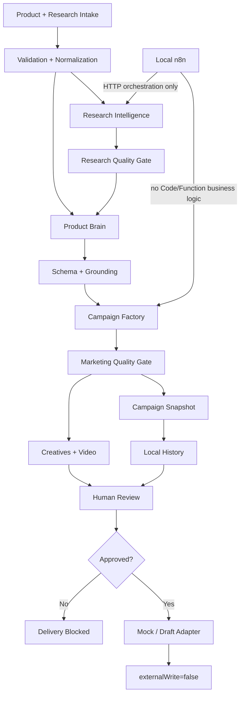
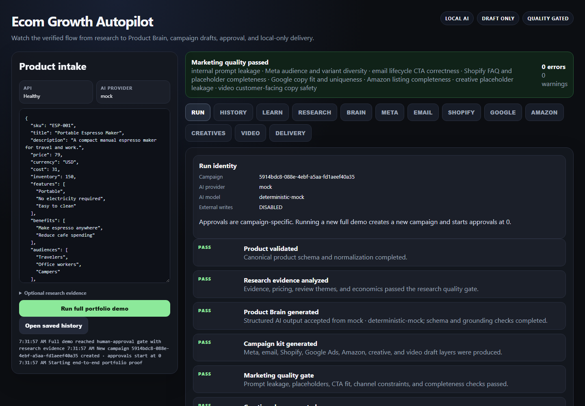
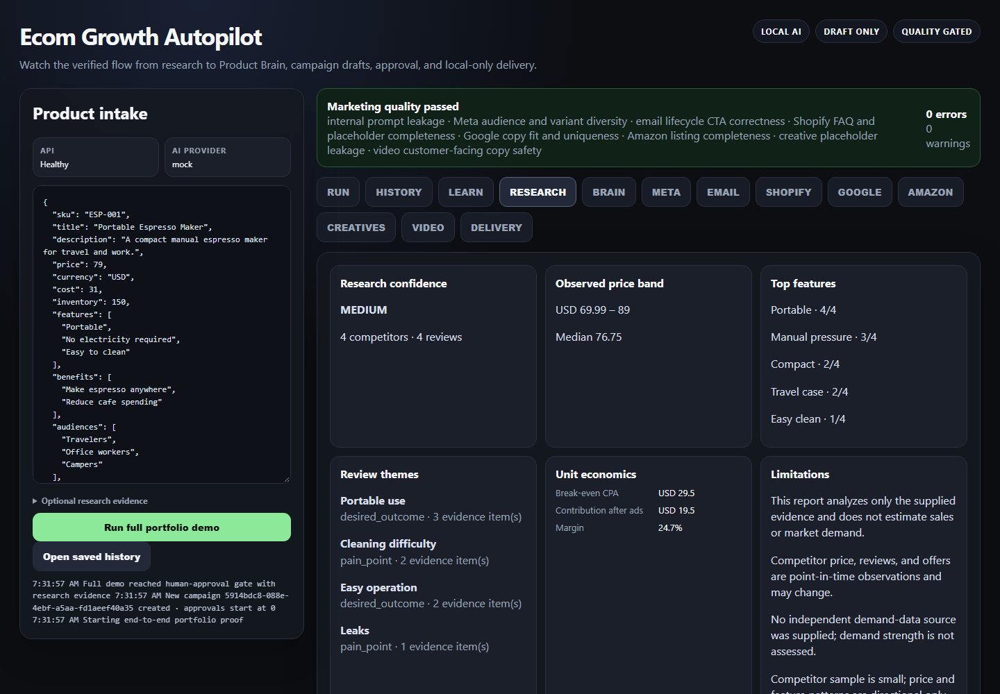
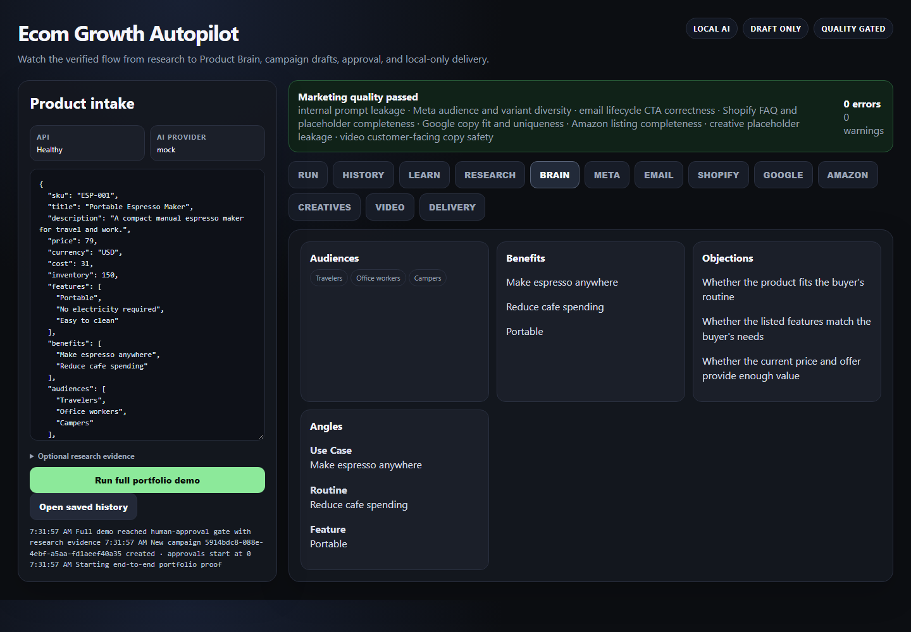
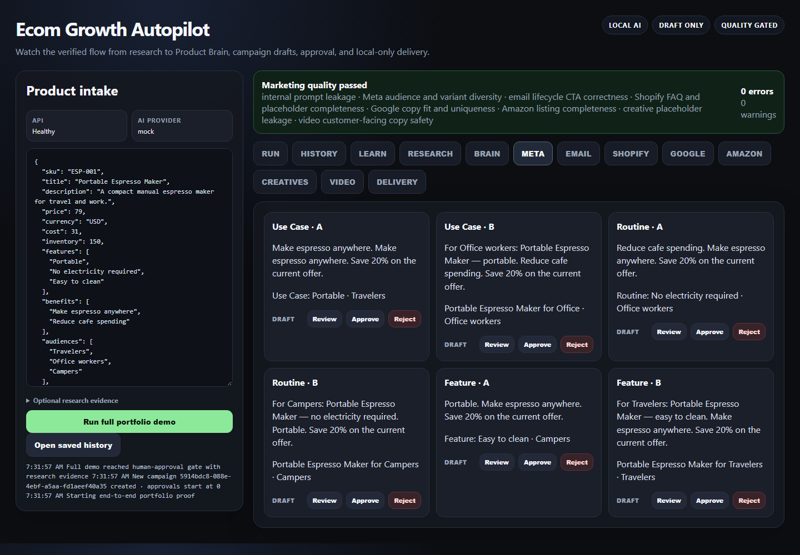
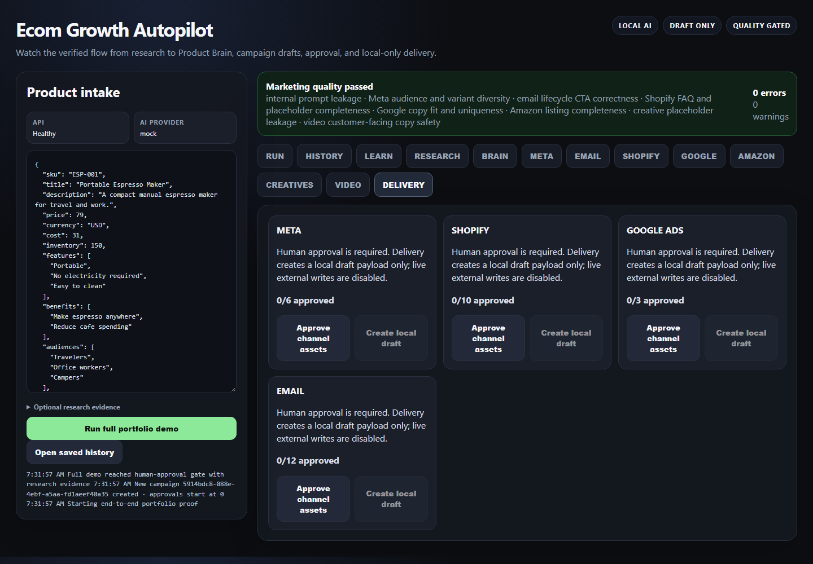
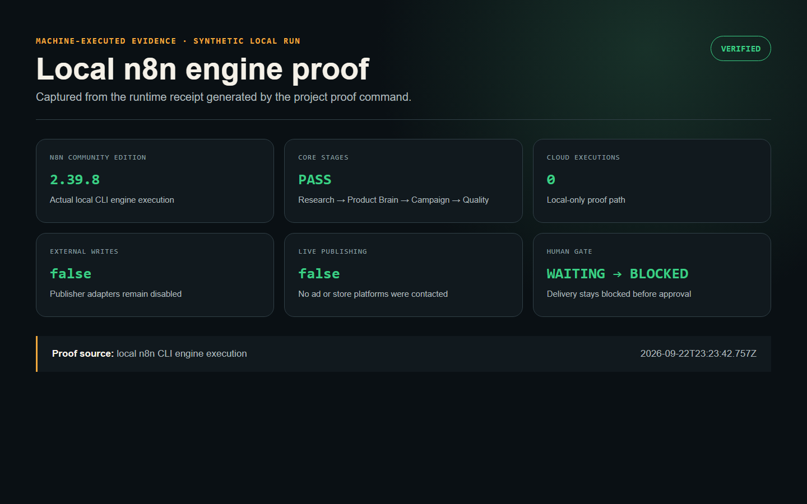

# Ecom Growth Autopilot

A local-first eCommerce automation portfolio project that connects evidence-backed product research, structured AI strategy, multi-channel campaign drafts, creative generation, human approval, and safe n8n orchestration.

[View the recruiter-facing portfolio case study](https://sean-monares-portfolio.vercel.app/projects/ecom-growth-autopilot/)

The project is intentionally designed around a constraint that matters in real automation work: **an AI-generated answer is not trusted just because it looks plausible**. Research conclusions, Product Brain output, marketing drafts, approvals, and delivery all pass explicit validation boundaries before the next stage can proceed.

> Portfolio baseline: local/mock/draft only. It cannot activate ads, spend budget, publish storefront changes, or send production email.

## What this demonstrates

- Evidence-backed product research with provenance, competitor/review analysis, feature/offer signals, and unit economics.
- A vendor-neutral `AIProvider` boundary with deterministic mock mode and local Ollama support.
- Structured Product Brain generation with schema validation, grounding, and one controlled repair attempt.
- Draft-only Meta, Google Ads, email, Shopify, and Amazon campaign outputs.
- A separate marketing-quality gate for prompt leakage, lifecycle CTA mistakes, placeholders, channel constraints, and completeness.
- Static creative generation plus a local FFmpeg/Chromium video-rendering path.
- Persisted campaign history, campaign-specific approvals, and fail-closed mock/draft delivery adapters.
- A local review dashboard with Run, Research, Campaign, Delivery, and Learn views.
- n8n Community Edition as an orchestration layer only; core business logic remains in testable TypeScript.
- Postman assets, Windows diagnostics, CI verification, secret scanning, and release handoff documentation.

## Architecture



TypeScript owns validation and business rules. Ollama is optional local AI. n8n sequences local HTTP calls. Human approval stays between generated assets and delivery.

## Verification status

The deterministic release gate is:

```bash
npm run verify
```

Current v0.9.3 deterministic baseline:

```text
66 tests
66 passed
0 failed

Package safety          PASS
Handoff state           PASS
Dependencies            PASS
Format                   PASS
Lint                     PASS
Types                    PASS
Secrets                  PASS
n8n export validation    PASS
Postman validation       PASS
Build                    PASS
n8n workflow contract    PASS
Research quality         PASS (expected sample warnings)
Marketing quality        PASS
```

The fixture research deliberately has a small sample and no independent demand-data source. The research gate therefore emits warnings instead of pretending demand has been measured.

Deterministic verification is separate from live-model and actual-engine proof. A real Ollama Product Brain smoke test was proven on the Windows development machine in an earlier verified checkpoint. The v0.9.3 one-command proof was also executed successfully through local n8n Community Edition 2.39.8 on Windows. Release preflight validated the saved runtime receipt with **0 n8n Cloud executions**, `externalWrites=false`, and `livePublishing=false`.

## Fastest Windows portfolio proof

Prerequisites already supported by the project are Node.js 22+, local n8n Community Edition, and optionally Ollama for the live-AI demo.

After extracting the flat release package, run:

```text
finish-portfolio-proof-windows.cmd
```

That wrapper:

1. runs the actual workflow through the local n8n CLI engine;
2. starts an isolated deterministic API on `127.0.0.1:3011`;
3. fails closed unless core stages pass and external writes/live publishing remain disabled;
4. saves `.runtime/n8n-engine-proof.json`;
5. ensures the project-local verification dependency is available;
6. runs the complete deterministic release preflight.

A successful run ends with:

```text
N8N ENGINE PROOF PASSED
PORTFOLIO PROOF COMPLETE
```

For debugging, the two lower-level commands remain:

```text
engine-proof-local-n8n-windows.cmd
portfolio-release-preflight-windows.cmd
```

No n8n Cloud execution is required by these proof paths.

## Dashboard

For a fast, deterministic recruiter/demo session:

```text
open-dashboard-safe-windows.cmd
```

This opens:

```text
http://127.0.0.1:3001/dashboard
```

Safe mode uses deterministic mock AI but exercises the same research, campaign, quality, history, approval, and delivery boundaries. It requires no platform credentials and performs no external writes.

For the local-Ollama-backed dashboard, use:

```text
open-dashboard-windows.cmd
```

The **Run** view makes the state machine visible as `PASS`, `WARNING`, `WAITING`, and `BLOCKED`. The **Learn** view explains each subsystem from business, technical, and interview perspectives.

## Product Research Intelligence

Research input supports structured source provenance, competitor evidence, review evidence, and seller-supplied economics. The analysis layer produces:

- observed price min/median/max/average;
- feature-frequency and offer-pattern signals;
- review themes linked back to imported evidence IDs;
- contribution economics and break-even CPA;
- explicit limitations and data confidence.

The system intentionally rejects fabricated fields such as opaque opportunity/winning scores or unsupported sales estimates. A demand conclusion is blocked when no demand-data source exists.

Useful commands:

```bash
npm run research:check
npm run research:demo
```

See `docs/PRODUCT-RESEARCH.md`.

## Product Brain

The Product Brain converts product facts plus optional research context into a structured strategy object containing audiences, pain points, benefits, objections, buying triggers, angles, and offer positioning.

Two provider modes matter:

- **Mock** — deterministic output for CI, regression testing, and safe demos.
- **Ollama** — local generation through the provider boundary for a real AI demonstration.

Model output is not passed downstream directly. It must survive schema validation and grounding; malformed output gets one controlled repair attempt before failure.

Local Ollama commands:

```bash
npm run doctor:ollama
npm run ollama:smoke
npm run dev:ollama
```

## Campaign factory and marketing quality

The campaign layer produces draft-only outputs for:

- Meta: three strategy angles with multiple variants;
- Google Ads: constrained headlines/descriptions;
- email: launch, abandoned cart, post-purchase, and win-back sequences;
- Shopify: structured landing-page draft;
- Amazon: listing draft;
- static creatives;
- six-scene, 20-second vertical-video storyboard.

The marketing-quality gate checks problems that a JSON schema cannot detect reliably, including internal prompt leakage, lifecycle CTA mismatches, unresolved publication placeholders, weak Meta variation, channel constraints, and incomplete sections.

```bash
npm run marketing:check
npm run demo:generate
```

Committed synthetic examples are under `examples/demo-output/`. Fixture-only URLs/tokens are explicitly labeled and are not production merchant assets.

## Real PNG and MP4 rendering

The media layer renders verified creative drafts locally without a paid creative API.

```bash
npm run media:doctor
npm run demo:full
```

The Windows helper is:

```text
render-media-windows.cmd
```

It can render three PNG ad sizes and a 20-second 1080×1920 H.264 MP4 using a local Chromium-family browser and FFmpeg.

## Human approval and safe delivery

Approvals are campaign-specific and persist locally. Delivery remains blocked until every required asset for a channel is approved.

The portfolio adapters support only `mock` and `draft` behavior. `live` mode is rejected and every delivery result reports:

```json
{
  "externalWrite": false
}
```

This is an architectural boundary, not merely a prompt instruction.

## n8n orchestration

All committed n8n exports are:

- inactive by default;
- credential-free;
- loopback/local-API only;
- free of Code/Function business logic.

The project contains five exports, including:

- `full-portfolio-demo.local.json` — production-style local webhook orchestration;
- `engine-proof-cli.local.json` — dedicated manual-trigger actual-engine proof.

`npm run n8n:contract` replays the exact production-style workflow contract against the real local API during deterministic verification. The actual engine proof is intentionally separate so the repository never confuses contract testing with execution inside n8n itself.

See `docs/LOCAL-N8N-PROOF.md`.

## Postman

`postman/` contains a local collection and environment for Ollama/application fault isolation, research/campaign endpoints, and proof status. No platform keys or merchant credentials are stored in these files.

```bash
npm run validate:postman
```

## Project structure

```text
src/                 TypeScript business logic
scripts/             local API, verification, diagnostics, proof runners
n8n/workflows/       inactive sanitized local workflows
postman/             local collection + environment
tests/               unit + integration regression coverage
examples/demo-output synthetic portfolio artifacts
docs/                architecture, code tour, handoff, release/demo material
dist/                prebuilt release output in flat portfolio package
```

For the exact file map, read `docs/PROJECT-INVENTORY.md`.

## CI and clean-machine setup

The project pins TypeScript `5.8.3` as a local development dependency. On a source checkout without local dependencies:

```bash
npm run setup
npm run verify
```

GitHub Actions runs deterministic verification on Node 22. `.env`, `.runtime/`, `node_modules/`, credentials, and local proof/history files are excluded from version control.

## Portfolio / recruiter material

The repository already includes:

- `docs/PORTFOLIO-CASE-STUDY.md`
- `docs/DEMO-SCRIPT.md`
- `docs/CODE-TOUR.md`
- `docs/ARCHITECTURE-DIAGRAM.md`
- `docs/GITHUB-PUBLISH.md`
- `docs/RELEASE-CHECKLIST.md`

The committed screenshots below were captured on 2026-09-23 from the deterministic local dashboard after a real end-to-end demo run. The n8n proof card is rendered from the fresh machine-executed runtime receipt. All inputs are synthetic; no customer, credential, or merchant data is shown.

Run `npm run portfolio:capture` after `npm run verify` and `npm run release:preflight` to regenerate the same evidence set from the local machine.

### Visual proof

| End-to-end run timeline | Research evidence and unit economics |
| --- | --- |
|  |  |
| Product Brain | Draft campaign outputs |
|  |  |
| Human approval and blocked delivery | Local n8n engine receipt |
|  |  |

The remaining optional presentation captures are the actual n8n canvas and a terminal verification screen. They are not required to understand or reproduce the verified flow, and they must not be fabricated. The exact status remains in [`docs/GITHUB-PUBLISH.md`](docs/GITHUB-PUBLISH.md#screenshots-to-capture).

`docs/CODE-TOUR.md` is written so the project can be explained from three perspectives: business value, technical path, and interview answer.

## Scope boundary

This is a portfolio engineering system, not a production ad-buying platform. Real authenticated publisher adapters are deliberately outside the current baseline. Before any live provider write is added, the project would need provider-specific sandbox/draft APIs, permission scopes, idempotency, rate-limit handling, rollback behavior, audit requirements, and explicit user authorization.

## Current release gate

The machine-specific proof is complete: v0.9.3 executed successfully through local n8n Community Edition 2.39.8 on Windows, and `release:preflight` validated the resulting runtime receipt. The GitHub source repository is published, and the six-image recruiter proof set is captured. The n8n canvas and terminal views remain optional presentation additions.

For continuity, future coding agents should read `PROJECT-STATE.json` and `CONTINUE-LATER.md` first and **must not redo verified phases**.
