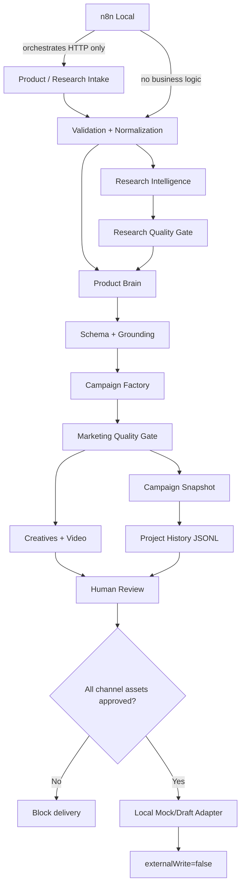

# Architecture diagram

## Boundaries

- TypeScript owns business logic and verification.
- Ollama is optional for deterministic tests and explicit for live local demos.
- n8n remains an orchestration layer.
- Project history is append-only and local.
- Platform adapters are local mock/draft boundaries only in the portfolio baseline.
